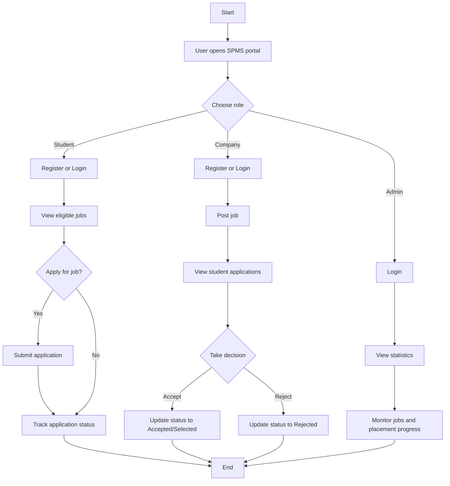
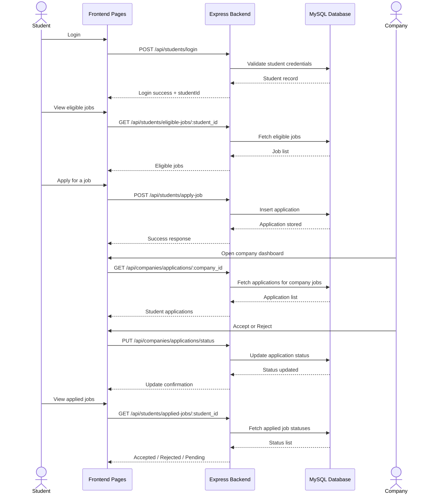
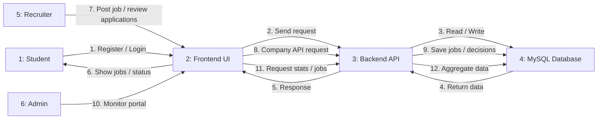
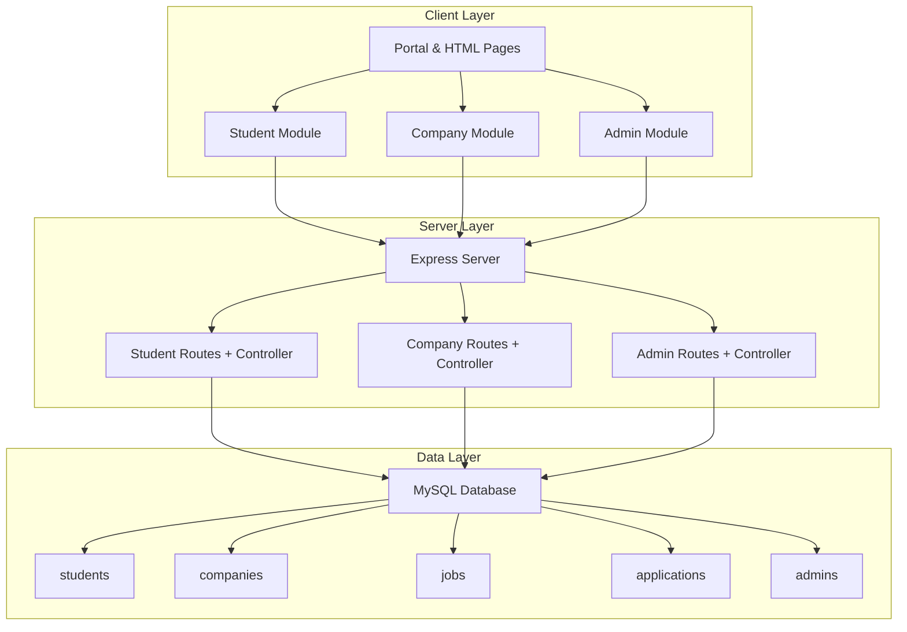
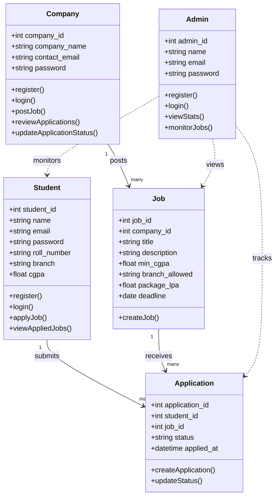
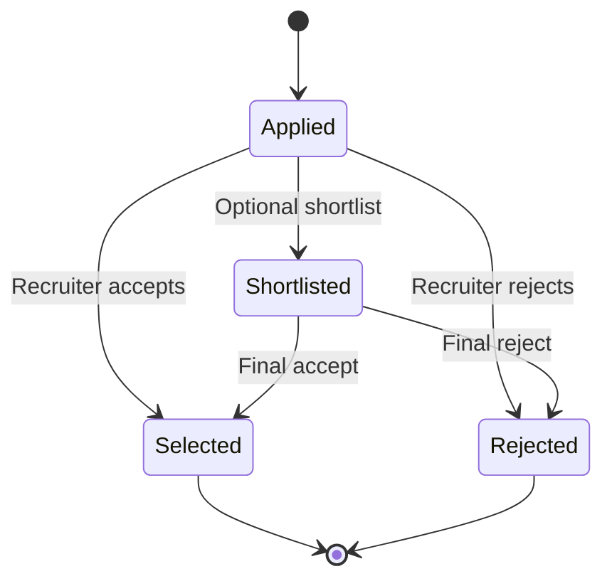

# SPMS UML Diagrams

## Activity Diagram

```mermaid
flowchart TD
    A["Start"] --> B["User opens SPMS portal"]
    B --> C{"Choose role"}

    C -->|Student| D["Register or Login"]
    D --> E["View eligible jobs"]
    E --> F{"Apply for job?"}
    F -->|Yes| G["Submit application"]
    G --> H["Track application status"]
    F -->|No| H

    C -->|Company| I["Register or Login"]
    I --> J["Post job"]
    J --> K["View student applications"]
    K --> L{"Take decision"}
    L -->|Accept| M["Update status to Accepted/Selected"]
    L -->|Reject| N["Update status to Rejected"]

    C -->|Admin| O["Login"]
    O --> P["View statistics"]
    P --> Q["Monitor jobs and placement progress"]

    H --> R["End"]
    M --> R
    N --> R
    Q --> R
```

## Sequence Diagram

```mermaid
sequenceDiagram
    actor Student
    participant Frontend as Frontend Pages
    participant API as Express Backend
    participant DB as MySQL Database
    actor Recruiter as Company

    Student->>Frontend: Login
    Frontend->>API: POST /api/students/login
    API->>DB: Validate student credentials
    DB-->>API: Student record
    API-->>Frontend: Login success + studentId

    Student->>Frontend: View eligible jobs
    Frontend->>API: GET /api/students/eligible-jobs/:student_id
    API->>DB: Fetch eligible jobs
    DB-->>API: Job list
    API-->>Frontend: Eligible jobs

    Student->>Frontend: Apply for a job
    Frontend->>API: POST /api/students/apply-job
    API->>DB: Insert application
    DB-->>API: Application stored
    API-->>Frontend: Success response

    Recruiter->>Frontend: Open company dashboard
    Frontend->>API: GET /api/companies/applications/:company_id
    API->>DB: Fetch applications for company jobs
    DB-->>API: Application list
    API-->>Frontend: Student applications

    Recruiter->>Frontend: Accept or Reject
    Frontend->>API: PUT /api/companies/applications/status
    API->>DB: Update application status
    DB-->>API: Status updated
    API-->>Frontend: Update confirmation

    Student->>Frontend: View applied jobs
    Frontend->>API: GET /api/students/applied-jobs/:student_id
    API->>DB: Fetch applied job statuses
    DB-->>API: Status list
    API-->>Frontend: Accepted / Rejected / Pending
```

## Collaboration Diagram

```mermaid
flowchart LR
    Student["1: Student"] -- "1. Register / Login" --> Frontend["2: Frontend UI"]
    Frontend -- "2. Send request" --> Backend["3: Backend API"]
    Backend -- "3. Read / Write" --> Database["4: MySQL Database"]
    Database -- "4. Return data" --> Backend
    Backend -- "5. Response" --> Frontend
    Frontend -- "6. Show jobs / status" --> Student

    Company["5: Recruiter"] -- "7. Post job / review applications" --> Frontend
    Frontend -- "8. Company API request" --> Backend
    Backend -- "9. Save jobs / decisions" --> Database

    Admin["6: Admin"] -- "10. Monitor portal" --> Frontend
    Frontend -- "11. Request stats / jobs" --> Backend
    Backend -- "12. Aggregate data" --> Database
```

## Component Diagram

```mermaid
flowchart TB
    subgraph Client["Client Layer"]
        Portal["Portal & HTML Pages"]
        StudentUI["Student Module"]
        CompanyUI["Company Module"]
        AdminUI["Admin Module"]
    end

    subgraph Server["Server Layer"]
        Express["Express Server"]
        StudentRoutes["Student Routes + Controller"]
        CompanyRoutes["Company Routes + Controller"]
        AdminRoutes["Admin Routes + Controller"]
    end

    subgraph Data["Data Layer"]
        MySQL["MySQL Database"]
        StudentsTable["students"]
        CompaniesTable["companies"]
        JobsTable["jobs"]
        ApplicationsTable["applications"]
        AdminsTable["admins"]
    end

    Portal --> StudentUI
    Portal --> CompanyUI
    Portal --> AdminUI

    StudentUI --> Express
    CompanyUI --> Express
    AdminUI --> Express

    Express --> StudentRoutes
    Express --> CompanyRoutes
    Express --> AdminRoutes

    StudentRoutes --> MySQL
    CompanyRoutes --> MySQL
    AdminRoutes --> MySQL

    MySQL --> StudentsTable
    MySQL --> CompaniesTable
    MySQL --> JobsTable
    MySQL --> ApplicationsTable
    MySQL --> AdminsTable
```

## Class Diagram

```mermaid
classDiagram
    class Student {
        +int student_id
        +string name
        +string email
        +string password
        +string roll_number
        +string branch
        +float cgpa
        +register()
        +login()
        +applyJob()
        +viewAppliedJobs()
    }

    class Company {
        +int company_id
        +string company_name
        +string contact_email
        +string password
        +register()
        +login()
        +postJob()
        +reviewApplications()
        +updateApplicationStatus()
    }

    class Admin {
        +int admin_id
        +string name
        +string email
        +string password
        +register()
        +login()
        +viewStats()
        +monitorJobs()
    }

    class Job {
        +int job_id
        +int company_id
        +string title
        +string description
        +float min_cgpa
        +string branch_allowed
        +float package_lpa
        +date deadline
        +createJob()
    }

    class Application {
        +int application_id
        +int student_id
        +int job_id
        +string status
        +datetime applied_at
        +createApplication()
        +updateStatus()
    }

    Company "1" --> "many" Job : posts
    Student "1" --> "many" Application : submits
    Job "1" --> "many" Application : receives
    Admin ..> Student : monitors
    Admin ..> Job : views
    Admin ..> Application : tracks
```

## State Diagram

```mermaid
stateDiagram-v2
    [*] --> Applied
    Applied --> Rejected : Recruiter rejects
    Applied --> Selected : Recruiter accepts
    Applied --> Shortlisted : Optional shortlist
    Shortlisted --> Selected : Final accept
    Shortlisted --> Rejected : Final reject
    Selected --> [*]
    Rejected --> [*]
```
